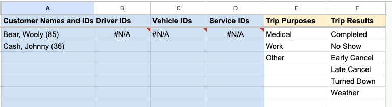

# Configuration

After installing RideSheet, you'll need to configure several settings to match your organization's needs. At minimum, you will need to fill in the 'Document Properties' sheet. You will also likely want to update the default Trip Purposes and Trip Results in the 'Lookups' sheet.

## Document Properties

`defaultStayDuration`
: The default duration in minutes that a customer will stay at their destination before a return trip; set to -1 to keep the pickup time for new trips blank

`driverManifestFolderId`
: The Google Drive folder ID where newly created driver manifests will be saved

`driverManifestTemplateDocId`
: The Google Doc ID of the template used to generate driver manifests

`dropOffToAppointmentTimeInMinutes`
: How many minutes before an appointment time the customer should be dropped off

`dwellTimeInMinutes`
: The amount of time in minutes allocated for loading/unloading at each stop

!!! note "Geocoder Bounds"
    Google Maps will give extra preference to the geocoder bounds when autocompleting or autofilling addresses. However, possible addresses will not be restricted to these bounds, and neither Google nor RideSheet will ensure that addresses fall within the geocoding bounds.

`geocoderBoundNeLatitude`
: The northern latitude boundary for address geocoding

`geocoderBoundNeLongitude`
: The eastern longitude boundary for address geocoding

`geocoderBoundSwLatitude`
: The southern latitude boundary for address geocoding

`geocoderBoundSwLongitude`
: The western longitude boundary for address geocoding

`localTimeZone`
: The time zone used for all date/time calculations (e.g. "America/New_York"); see [all timezone codes](https://en.wikipedia.org/wiki/List_of_tz_database_time_zones)

`providerName`
: The name of your organization

`runFullReviewRequiredFields`
: Comma-separated list of fields that must be completed before a run can be archived

`runUserReviewRequiredFields`
: The names of run columns that must have data in them in order to for RideSheet to calculate deadhead or other run information.

`tripPaddingPerHourInMinutes`
: Extra time in minutes added per hour of estimated trip duration for traffic/delays

`tripReviewCompletedTripResults`
: Comma-separated list of trip results that count as "completed" for reporting

`tripReviewRequiredFields`
: Comma-separated list of fields that must be completed before a trip can be archived

## Lookups

The 'Lookups' sheet contains items used for filling the dropdown boxes throughout RideSheet. Most columns in this sheet (colored in blue) will automatically populate when you add entries to other sheets:

- Customer names and IDs populate from the Customers sheet
- Driver IDs populate from the Drivers sheet
- Vehicle IDs populate from the Vehicles sheet
- Service IDs populate from the Services sheet

However, you can and should edit the `Trip Purposes` and `Trip Results` columns to reflect the categories of information you want to track for your organization.

*Drivers, vehicles, and services are all missing in this example, and need to be created on their respective sheets in order to show up*.

## Customization Options

RideSheet is designed to be customizable to meet different organizations' needs. There are several ways to customize your installation:

- For basic customizations like adding columns or modifying the manifest template, see the [User Guide page on customization](../user-guide/customization.md)
- For advanced customizations involving code changes, see the [Apps Script](apps-script.md) page to learn about:
  - Using local scripts
  - Updating validation rules
  - Modifying formatting
  - Customizing menus
  - And more
