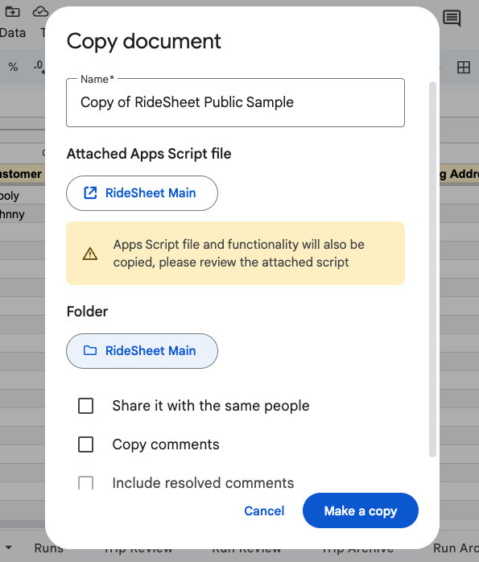
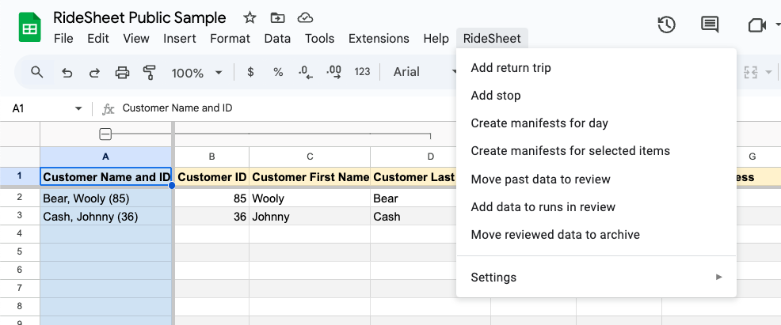
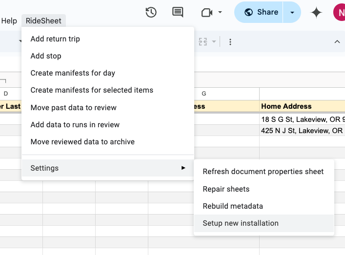

# Installing RideSheet

Before you begin installing RideSheet, you may want to review the [Getting Started](../getting-started.md) guide for an overview of RideSheet and its requirements.

## Set Up Google Workspace

RideSheet requires a Google Workspace account. If you haven't already, you'll need to:

1. Sign up for [Google Workspace](https://www.google.com/nonprofits/offerings/workspace/#)
2. Verify your domain ownership through the Google Workspace admin console
3. Set up user accounts for your organization

## Create a Copy of RideSheet

Open the [public RideSheet template](https://docs.google.com/spreadsheets/d/1U_rmR08qW63hEK_5IWblzVXK4ZqQElaD1ymAQNGpNiU/edit?gid=1631993398#gid=1631993398).

### Make Your Copy

1. Open [the template](https://docs.google.com/spreadsheets/d/1U_rmR08qW63hEK_5IWblzVXK4ZqQElaD1ymAQNGpNiU/edit?gid=1631993398#gid=1631993398) while logged in with your Google Workspace account
2. Select File > Make a copy
3. Choose a location for your copy:
    - We strongly recommend using a [Shared Drive](https://support.google.com/a/users/answer/9310351?sjid=2044455304611340116-NC) rather than My Drive
    - Shared Drives provide better permission management and ownership transfer capabilities
4. Give your copy a name and click "Make copy"

{ width="300"}

!!! info "Important"
    Create this copy while logged in as a user attached to your Google Workspace account. This ensures proper permissions and ownership.

## Authorize Apps Script

After creating your copy, you'll need to authorize the RideSheet Apps Script:

1. Look for the 'RideSheet' menu in the main menu bar
    - If you don't see it immediately, refresh the page and wait a moment
    - If it still doesn't appear, verify your domain and Google Workspace permissions
2. Select any action from the RideSheet menu (the specific action doesn't matter)
3. You'll see a pop-up requesting authorization
4. Follow the authorization prompts, selecting "Allow" when asked

!!! tip "Unsafe Warning"
    All RideSheet users will need to complete this authorization process. If users see an **Unsafe** warning, they can:

    1. Click "Advanced" at the bottom of the pop-up
    2. Click "Go to RideSheet (unsafe)"
    3. Click "Allow" to authorize the script

## Complete Initial Setup

1. From the RideSheet menu, select Settings > Setup New Installation
2. This process will:
    - Create a Manifests and Templates folder
    - Copy the manifest template from the public version
    - Set up required Document Properties

## Next Steps

Once installation is complete, proceed to the [Configuration](configuration.md) section to set up your RideSheet instance for your organization.
