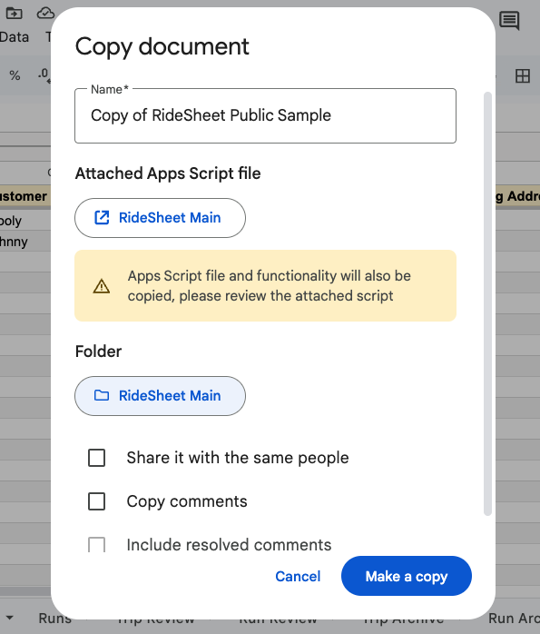

# Installing RideSheet

Before you begin installing RideSheet, you may want to review the [Getting Started](../getting-started.md) guide for an overview of RideSheet and its requirements.

  <iframe
    style="position: absolute; top: 0; left: 0; width: 100%; height: 100%;"
    src="https://www.youtube-nocookie.com/embed/6zriVg6I6KA"
    title="YouTube video player"
    frameborder="0"
    allow="accelerometer; autoplay; clipboard-write; encrypted-media; gyroscope; picture-in-picture"
    allowfullscreen>
  </iframe>

## Set Up Google Workspace

RideSheet requires a Google Workspace account. If you haven't already, you'll need to:

1. Sign up for [Google Workspace](https://www.google.com/nonprofits/offerings/workspace/#)
2. Verify your domain ownership through the Google Workspace admin console
3. Set up user accounts for your organization

## Create a Copy of RideSheet

Open the [public RideSheet template](https://docs.google.com/spreadsheets/d/1PpcZfdDt7WtcIMy4Ii6E05VenQidmeyl-NVZngziNbw/edit?usp=sharing).

### Make Your Copy

1. Open [the template](https://docs.google.com/spreadsheets/d/1PpcZfdDt7WtcIMy4Ii6E05VenQidmeyl-NVZngziNbw/edit?usp=sharing) while logged in with your Google Workspace account
2. Select File > Make a copy
3. Choose a location for your copy:
    - We strongly recommend using a [Shared Drive](https://support.google.com/a/users/answer/9310351?sjid=2044455304611340116-NC) rather than My Drive
    - Shared Drives provide better permission management and ownership transfer capabilities
4. Give your copy a name and click "Make copy"

{ width="300"}

!!! info "Important"
    Create this copy while logged in as a user attached to your Google Workspace account. This ensures proper permissions and ownership.

## Run the New Installation

After your copy opens, a **welcome message will appear automatically**. It will confirm that you have a fresh copy of RideSheet and provide instructions for completing the setup.

- Select **Set Up New Installation** from the **New Install** menu

### Authorize RideSheet

2. A dialog will appear asking you to authorize the script — click **OK**
3. If prompted, validate your identity and account
3. Google will display a warning that it hasn't verified this app
    1. Click **Advanced** 
    2. Click **Go to RideSheet (unsafe)** to proceed
5. Review the requested permissions and click **Select All**, then **Continue**

!!! warning "Unverified App Warning"
    Seeing this warning is normal for RideSheet. Because RideSheet is open source, you can review exactly what it does before authorizing. See the [Permissions](permissions.md) page for a full explanation of what permissions are requested and why.

## Set Up RideSheet Folders

The installation process will walk you through two setup steps, each requiring you to create a folder in Google Drive and paste its URL into RideSheet.

### Step 1: Driver Manifests Folder

RideSheet saves driver manifests as PDFs or Google Docs. You need to specify a folder where these will be stored.

1. The installer will suggest the name **RideSheet Driver Manifest** — copy it
2. In a new tab, open [Google Drive](https://drive.google.com)
3. Navigate to your RideSheet folder and create a new folder with the suggested name
4. Open the new folder and copy its URL from the browser's address bar
5. Paste the URL into the RideSheet installation prompt and click **OK**

### Step 2: Settings Folder

RideSheet also needs a folder to store the driver manifest template and other settings.

1. The installer will suggest the name **RideSheet Settings** — copy it
2. In Google Drive, navigate to your RideSheet folder and create a new folder with the suggested name
3. Open the new folder and copy its URL from the browser's address bar
4. Paste the URL into the RideSheet installation prompt and click **OK**

After a brief pause, you will see an **Installation Complete** message.

## After Installation

Once installation is complete:

- Open your **RideSheet Settings** folder in Google Drive — you will find the **RideSheet Manifest Template** there, which you can customize to match your organization's preferred manifest format
- Refresh the spreadsheet — the **RideSheet** menu will be available and the **New Install** menu will be gone

## Next Steps

Once installation is complete, proceed to the [Configuration](configuration.md) section to set up your RideSheet instance for your organization.
