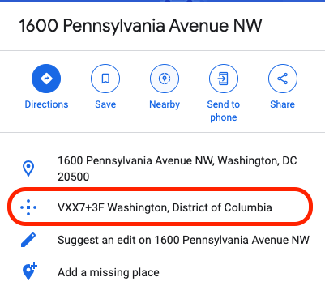

# Data Fields

## Data Types
### Address Fields
RideSheet uses different types of address formats to manage locations effectively. RideSheet uses Google Maps services to verify and autocomplete address information. Anytime a user enters a new address in a RideSheet address cell, RideSheet will send it to Google Maps to ensure that it can be correctly associated with one and only one physical location on a map. If this is successful, RideSheet will replace the submitted address with one that follows Google’s standard formatting, which generally includes ZIP code and country, as in, “1600 Pennsylvania Avenue NW, Washington, DC 20500, USA.” If the address cannot be associated with a single location, it will be formatted with a red background and the error message from Google Maps will appear as a note for the cell.

#### Street Addresses
Street addresses are used to specify physical locations. RideSheet should be able to extrapolate from a street/city address, such as "1600 Pennsylvania Ave NW, Washington DC". 

#### Plus Codes
[Plus Codes](https://maps.google.com/pluscodes/) are short codes derived from latitude and longitude coordinates. They provide precise locations, especially in rural or less accessible areas. An example of a Plus Code format is "VXX7+3FV, Washington, DC, USA".

Plus Codes are useful because Google Maps does not always have accurate latitude and longitude coordinates for rural addresses. This could make it difficult for a driver to know which private road to turn onto from a highway when using Google Maps driving directions. It can also be useful for identifying a specific pickup point in a large complex such as a hospital or shopping center.

Plus codes can be retrieved from most addresses in Google Maps’s description pane, as shown below.

To get the Plus Code for a location not directly associated with an address (e.g. clicking on a specific spot on Google Maps), this can be achieved by clicking on the map so that a small grey pin icon appears along with a small window showing that locations latitude and longitude, and then clicking on the latitude and longitude, as demonstrated in the images below.

Watch a [tutorial video](https://www.youtube.com/watch?v=mywc0qhQh3E) on how to use plus codes with RideSheet.

#### Address Descriptions
Address descriptions are optional and used to provide additional information about a location, such as specific instructions for drivers. They are enclosed in parentheses and do not affect geolocation.

#### Combining Address Elements
RideSheet supports combining address elements. For example:
- Street Address: "1600 Pennsylvania Avenue NW, Washington, DC 20500, USA"
- Plus Code: "VXX7+3FV"
- Address Description: "(The White House)"
- Combined: "VXX7+3FV; 1600 Pennsylvania Avenue NW, Washington, DC 20500, USA (The White House)"

#### Common Addresses
Common addresses can be stored with short names for easy reference. When a short name is entered, RideSheet replaces it with the corresponding full address. These can be created in the [Addresses](#addresses) sheet.

## Fields by Sheet
### Trips

#### Required Fields

`Trip Date`
:   A date in m/d/yyyy format. When clicking on the `Trip Date` field, it should offer a datepicker pop-up as well.

`Customer Name and ID`
:   A valid customer must be selected from the dropdown. They must be added to the `Customers` sheet first in order to appear in the dropdown menu.

`PU Time`, `DO Time`, and `Appt Time`
:   Either `PU Time`, `DO Time`, or `Appt Time` must be filled in. If any one of these fields is provided, along with a `PU Address` and `DO Address`, RideSheet will automatically estimate the trip time and fill in the other field(s). You may also manually edit the field to override the RideSheet estimate.

`PU Address` and `DO Address`
:   Both the `PU Address` and `DO Address` are required. If a `Default PU Address` or `Default DO Address` is provided in the Customers sheet, RideSheet will autofill those values. They may be overwritten by the user. Learn more about [Address Fields](#address-fields).

`Driver ID`
:   A `Driver ID` must be selected from the dropdown in order to generate manifests and run information. Driver information is entered in the [Drivers](#drivers) sheet.

`Vehicle ID`
:   A `Vehicle ID` must be selected from the dropdown in order to generate manifests and run information. Vehicle information is entered in the [Vehicles](#vehicles) sheet.

`Service ID`
:   A `Service ID` must be selected from the dropdown in order to generate report information. Service information is entered in the [Services](#services) sheet.

#### Optional Fields

`Guests`
:   The number of riders, such as caregivers or other guests, apart from the primary customer.

`Mobility Factors`
:   May be automatically filled in from `Default Mobility Factors` in the `Customers` sheet. Mobility factors will be included on the Driver Manifest.

`Trip Purpose`
:   Dropdown is populated from the `Lookups` sheet.

`Notes`
:   Any notes will be included on the Driver Manifest.

#### Calculated Fields

Calculated fields are colored blue. These fields are automatically calculated by RideSheet and should not be edited.

`Est Miles` and `Est Hours`
:   Calculated using Google Maps travel estimates.

`|Run OK?|`
:   Shows whether a specific combination of driver and vehicle is valid at the given day and time for the trip.

### Customers

#### Default Fields

When a customer field starts with the word **Default**, its value will be automatically copied into a new trip record if there is a matching field without the word “Default” in the trips tab. For example, in the base version of RideSheet there is a `Default PU Address` field in the Customers sheet and a `PU Address` field in the Trips tab. If the `Default PU Address` field for a customer is filled in, then whenever a new trip for that customer is created, the `PU Address` field of the trips will be filled in with the `Default PU Address` value. If the default value for any particular trip is not appropriate, then the field can simply be cleared and replaced with the correct value.

#### Required Fields

Just the `Customer First Name`, `Customer Last Name`, and `Phone Number` are required.

If you do not provide a `Customer ID`, RideSheet will automatically fill in the next available ID number.

### Runs

#### Required Fields

`Run Date`
:   Date in m/d/yyyy format. A datepicker should appear when the field is selected.

`Driver ID`
:   A `Driver ID` must be selected from the dropdown in order to generate manifests and run information. Driver information is entered in the [Drivers](#drivers) sheet.

`Vehicle ID`
:   A `Vehicle ID` must be selected from the dropdown in order to generate manifests and run information. Vehicle information is entered in the [Vehicles](#vehicles) sheet.

`Scheduled Start Time`
:   Used to determine if a run is valid in `Trips`.

`Scheduled End Time`
:   Used to determine if a run is valid in `Trips`.

#### Calculated Fields

`|First PU Time|`, `|Last DO Time|`, and `|Trip Count|`
:   All automatically calculated by RideSheet based on information in `Trips`. These fields should not be edited.

### Trip Review

Trip Review has most of the same fields as [Trips](#trips).

`Trip Result`
:   The `Trip Result` must be selected from the dropdown menu for all trips. All trip results for a single day must be filled in order to calculate certain run data, such as revenue miles and hours. The possible options can be updated in the [Lookups](#lookups) sheet.

### Trip Archive

Trip Archive has all the fields from [Trip Review](#trip-review). Trip Archive is used to keep track of all past trips, and is used in reporting. **Trips should not be edited or removed once in the archive**.

### Run Review

Run Review has most of the same fields as [Runs](#runs). The following fields are unique to Run Review:

`Actual Start Time`
:   The actual start time for the run.

`Actual End Time`
:   The actual end time for the run.

`Break Time in Minutes`
:   Driver break time during the run (between the start and end time).

`Odometer Start` and `Odometer End`

#### Calculated Fields

The remaining fields are colored blue and should not be edited. These are automatically calculated after running [add data to runs in review](using-ridesheet.md/#adding-data-to-runs-in-review).

### Run Archive

Run Archive has the all the fields from [Run Review](#run-review). Run Archive is used to keep track of all past runs, and is used in reporting. **Runs should not be edited or removed once in the archive**.

### Addresses

Addresses can be used for defining common locations and making data entry easier. Any `Short Name` that is present in `Addresses` can be used within any of the other address fields in RideSheet, and RideSheet will automatically fill in the full address.

### Vehicles

`Vehicles` are used within dropdowns in `Runs` and `Trips`. Any vehicle added here will automatically appear in the dropdowns. If a vehicle is removed from service, it should not be removed from this sheet or else it will invalidate past data. Instead, use the `Vehicle End Date` field to indicate that the vehicle is not longer operating.

The `Garage Address` is required to provide deadhead calculations in `Run Review`.

### Drivers

`Drivers` are used within dropdowns in `Runs` and `Trips`. Any driver added here will automatically appear in the dropdowns. If a driver is no longer available, they should not be removed from this sheet or else it will invalidate past data. Instead, use the `Driver End Date` field to indicate that the driver is no longer available.

A `Default Vehicle ID` can be set so the `Vehicle ID` field automatically populates when this driver is selected.

### Services

`Services` are used within dropdowns in `Trips` and are used in generating reports. 

If a service is no longer available, it should not be removed from this sheet or else it will invalidate past data. Instead, use the `Service End Date` field to indicate that the service is no longer available.

### Lookups

Most fields in `Lookups` are automatically generated, as indicated by the blue background.

`Trip Purposes` and `Trip Results` can be edited in order to update dropdown options in the `Trips` and `Trip Review` sheets.

### Document Properties

Document properties are used to configure RideSheet. Most of these will be set when RideSheet is initially installed, and not need to be edited again. However, the following may be useful to be aware of, in order to improve the accuracy of trip time estimates:

`dropOffToAppointmentTimeInMinutes`
:   The length of time in minutes between the drop-off time and the appointment time.

`dwellTimeInMinutes`
:   The length of time in minutes added to the journey time to account for the time it takes to pick up and drop off a rider.

`defaultStayDuration`
:   When creating a next leg or return trip, this is the length of time in minutes to set as the duration between rider dropoff or appt time and the pickup time of the next trip. Set to -1 (negative one) to keep the pickup time for the new trip blank.

`tripPaddingPerHourInMinutes`
:   The length of time in minutes added to each hour of estimated travel time to account for weather, traffic, or other possible delays.

