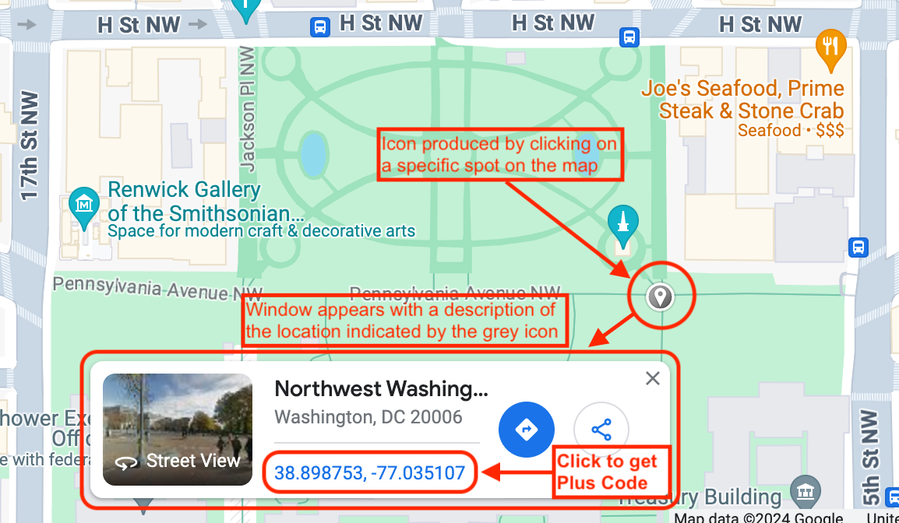

# Data Fields

## Data Types
### Address Fields
RideSheet uses different types of address formats to manage locations effectively. RideSheet uses Google Maps services to verify and autocomplete address information. Anytime a user enters a new address in a RideSheet address cell, RideSheet will send it to Google Maps to ensure that it can be correctly associated with one and only one physical location on a map. If this is successful, RideSheet will replace the submitted address with one that follows Google’s standard formatting, which generally includes ZIP code and country, as in, “1600 Pennsylvania Avenue NW, Washington, DC 20500, USA.” If the address cannot be associated with a single location, it will be formatted with a red background and the error message from Google Maps will appear as a note for the cell.

#### Street Addresses
Street addresses are used to specify physical locations. RideSheet should be able to extrapolate from a street/city address, such as "1600 Pennsylvania Ave NW, Washington DC". 

#### Plus Codes
[Plus Codes](https://maps.google.com/pluscodes/) are short codes derived from latitude and longitude coordinates. They provide precise locations, especially in rural or less accessible areas. An example of a Plus Code format is "VXX7+3FV, Washington, DC, USA".

Plus Codes are useful because Google Maps does not always have accurate latitude and longitude coordinates for rural addresses. This could make it difficult for a driver to know which private road to turn onto from a highway when using Google Maps driving directions. It can also be useful for identifying a specific pickup point in a large complex such as a hospital or shopping center.

Plus codes can be retrieved from most addresses in Google Maps’s description pane, as shown below.

To get the Plus Code for a location not directly associated with an address (e.g. clicking on a specific spot on Google Maps), this can be achieved by clicking on the map so that a small grey pin icon appears along with a small window showing that locations latitude and longitude, and then clicking on the latitude and longitude, as demonstrated in the images below.

Watch a [tutorial video](https://www.youtube.com/watch?v=mywc0qhQh3E) on how to use plus codes with RideSheet.

#### Address Descriptions
Address descriptions are optional and used to provide additional information about a location, such as specific instructions for drivers. They are enclosed in parentheses and do not affect geolocation.

#### Combining Address Elements
RideSheet supports combining address elements. For example:
- Street Address: "1600 Pennsylvania Avenue NW, Washington, DC 20500, USA"
- Plus Code: "VXX7+3FV"
- Address Description: "(The White House)"
- Combined: "VXX7+3FV; 1600 Pennsylvania Avenue NW, Washington, DC 20500, USA (The White House)"

#### Common Addresses
Common addresses can be stored with short names for easy reference. When a short name is entered, RideSheet replaces it with the corresponding full address. These can be created in the [Addresses](#addresses) sheet.

### Dates and Times
**[Kevin]** Does it seem useful to describe how dates/times are handled?

## Fields by Sheet
### Trips

| Field Name                | Description                  |
|---------------------------|------------------------------|
| Trip Date                 | description                  |
| Customer Name and ID      | description                  |
| Action                    | description                  |
| Go                        | description                  |
| PU Time                   | description                  |
| DO Time                   | description                  |
| Appt Time                 | description                  |
| PU Address                | description                  |
| DO Address                | description                  |
| Driver ID                 | description                  |
| Vehicle ID                | description                  |
| Service ID                | description                  |
| Guests                    | description                  |
| Mobility Factors          | description                  |
| Notes                     | description                  |
| Est Hours                 | description                  |
| Est Miles                 | description                  |
| Trip ID                   | description                  |

### Customers

| Field Name                 | Description                  |
|----------------------------|------------------------------|
| Customer Name and ID       | description                  |
| Customer ID                | description                  |
| Customer First Name        | description                  |
| Customer Last Name         | description                  |
| Phone Number               | description                  |
| Email                      | description                  |
| Mailing Address            | description                  |
| Home Address               | description                  |
| Default PU Address         | description                  |
| Default DO Address         | description                  |
| Default Service ID         | description                  |
| Default Service Level      | description                  |
| Default Mobility Factors   | description                  |
| Customer Manifest Notes    | description                  |
| Customer Private Notes     | description                  |
| Customer Start Date        | description                  |
| Customer End Date          | description                  |

### Runs

| Field Name                 | Description                  |
|----------------------------|------------------------------|
| Run Date                   | description                  |
| Driver ID                  | description                  |
| Vehicle ID                 | description                  |
| Scheduled Start Time       | description                  |
| First PU Time              | description                  |
| Last DO Time               | description                  |
| Scheduled End Time         | description                  |

### Trip Review

Trip Review has most of the same fields as [Trips](#trips).

The following fields are unique to Trip Review:

| Field Name                | Description                  |
|---------------------------|------------------------------|
| Trip Result                 | description                  |
| Actual PU Time      | description                  |
| Actual DO Time                   | description                  |
| Start ODO                      | description                  |
| End ODO                  | description                  |

### Trip Archive

Trip Archive has all the fields from [Trip Review](#trip-review). Trip Archive is used to keep track of all past trips, and is used in reporting. **Trips should not be edited or removed once in the archive**.

### Run Review

Run Review has most of the same fields as [Runs](#runs)

The following fields are unique to Run Review:

| Field Name                 | Description                  |
|----------------------------|------------------------------|
| Actual Start Time          | description                  |
| Actual End Time            | description                  |
| Odometer Start             | description                  |
| Odometer End               | description                  |

### Run Archive

Run Archive has the all the fields from [Run Review](#run-review). Run Archive is used to keep track of all past runs, and is used in reporting. **Runs should not be edited or removed once in the archive**.

### Addresses

| Field Name                 | Description                  |
|----------------------------|------------------------------|
| Short Name         | description                  |
| Address           | description                  |

### Vehicles

| Field Name                 | Description                  |
|----------------------------|------------------------------|
| Vehicle ID                 | description                  |
| Vehicle Name               | description                  |
| Garage Address             | description                  |
| Seating Capacity           | description                  |
| Wheelchair Capacity        | description                  |
| Scooter Capacity           | description                  |
| Has Ramp                   | description                  |
| Has Lift                   | description                  |
| Vehicle Start Date         | description                  |
| Vehicle End Date           | description                  |

### Drivers

| Field Name           | Description                  |
|----------------------|------------------------------|
| Driver ID            | description                  |
| Driver Name          | description                  |
| Driver Email         | description                  |
| Default Vehicle ID   | description                  |
| Driver Calendar ID   | description                  |
| Driver Start Date    | description                  |
| Driver End Date      | description                  |

### Services

| Field Name         | Description                  |
|--------------------|------------------------------|
| Service ID         | description                  |
| Service Name       | description                  |
| Service Funder     | description                  |
| Service Start Date | description                  |
| Service End Date   | description                  |

### Lookups

| Field Name            | Description                  |
|-----------------------|------------------------------|
| Customer Names and IDs| description                  |
| Driver IDs            | description                  |
| Vehicle IDs           | description                  |
| Service IDs           | description                  |
| Trip Purposes         | description                  |
| Trip Results          | description                  |
ß

### Document Properties

| Field Name                          | Description                  |
|-------------------------------------|------------------------------|
| apiGetAccess                        | description                  |
| apiGiveAccess                       | description                  |
| apiShowMenuItems                    | description                  |
| calendarIdForUnassignedTrips        | description                  |
| configFolderId                      | description                  |
| defaultStayDuration                 | description                  |
| driverManifestFolderId              | description                  |
| driverManifestTemplateDocId         | description                  |
| dropOffToAppointmentTimeInMinutes   | description                  |
| dwellTimeInMinutes                  | description                  |
| extraHeaderNames                    | description                  |
| geocoderBoundNeLatitude             | description                  |
| geocoderBoundNeLongitude            | description                  |
| geocoderBoundSwLatitude             | description                  |
| geocoderBoundSwLongitude            | description                  |
| localTimeZone                       | description                  |
| logLevel                            | description                  |
| monthlyBackupFolderId               | description                  |
| monthlyFileRetentionInDays          | description                  |
| nightlyBackupFolderId               | description                  |
| nightlyFileRetentionInDays          | description                  |
| notificationEmail                   | description                  |
| providerName                        | description                  |
| runReviewRequiredFields             | description                  |
| tripCalendarEntryTitleTemplate      | description                  |
| tripPaddingPerHourInMinutes         | description                  |
| tripReviewCompletedTripResults      | description                  |
| tripReviewRequiredFields            | description                  |
| weeklyBackupFolderId                | description                  |
| weeklyFileRetentionInDays           | description                  |
