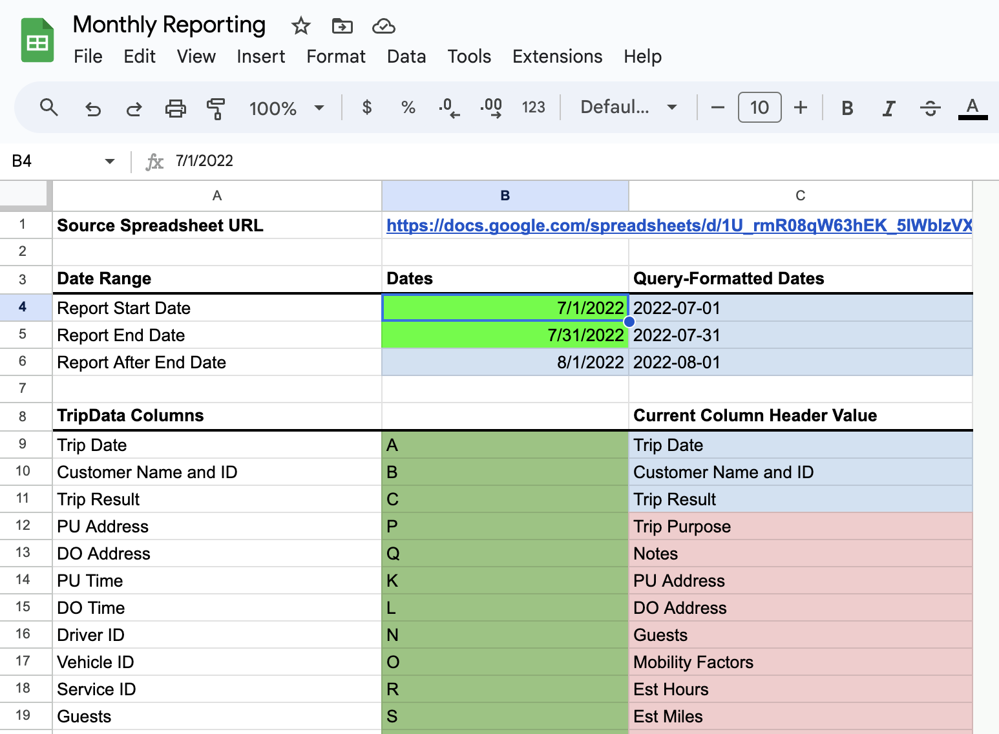
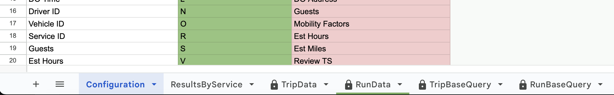

# Reports

RideSheet allows you to create custom reports and automatically calculate billable mileage on a per-service basis.

## Overview

Reports are located in a separate spreadsheet from your RideSheet. They should be located in the same folder as RideSheet in your Google Drive, in a sub-folder simply called **Reports**.

The first sheet of your reports should look something like this:

At the bottom of the window, there are several other sheets. Most of these have a lock icon. The locked sheets should not be edited! The only sheets you will need to open are `Configuration` and `ResultsByService`.

## Generating a Report

In the **Configuration** sheet, the only fields you will need to edit are the `Report Start Date` and `Report End Date`, which are colored in bright lime green. Simply fill in the first and last date you want included in the report.

Then, navigate to the **ResultsByService** tab. From here, you can select specific services in the dropdown, and the rest of the report data will populate automatically.

