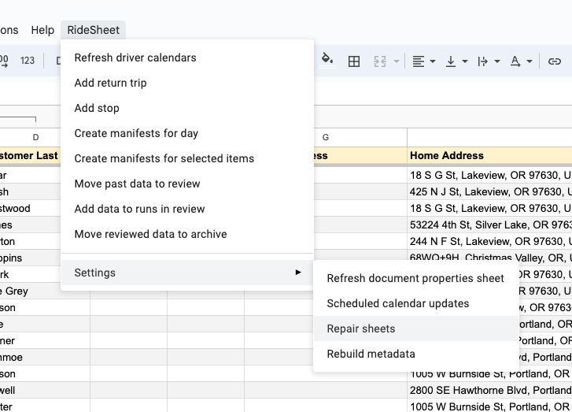
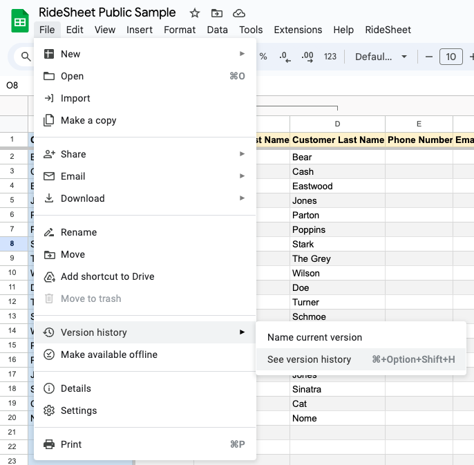

# Troubleshooting

Because RideSheet is spreadsheet-based and highly customizable, it is possible to edit fields or make changes which cause core functionality to break. Below are some of the most common issues, and ways to fix them. If none of these work, try [getting help](getting-help.md).

!!! tip "Version History"
    Google Sheets keeps a detailed version history of RideSheet, and you can easily revert to a past version at any time. If you catch an issue quickly enough, fixing it may be as simple as winding back time!

## Repairing RideSheet

RideSheet is designed to be self-healing as much as possible. If you have accidentally edited a header or changed the formatting on a column, it may be able to restore itself. From the RideSheet menu, run `Settings > Repair Sheets`. This may take some time to run.

## Restoring a Previous Version

If you catch the issue early enough, you may be able to revert to a past version. Please note that this will also remove any data, such as trips or customers, that you have entered since that point. 

Before restoring to a previous version, [make a copy](using-ridesheet.md/#creating-backups) of your current RideSheet. This way you can easily transfer over any data that may need to be re-entered.

In the main menu, select `File > Version History > See version history`.

Once in the version history, you can click through the menu on the righthand side of the screen. When you have located the latest version that you know was working correctly, click the blue button at the top of the page to "Restore this version".

## Using the Debug Log (Advanced)

On the bottom tab of RideSheet, you may see a sheet labeled `Debug Log`.

This sheet provides technical information for issues, and will likely only be helpful to fairly technical users. See the [Technical Troubleshooting Guide](../technical-guide/troubleshooting.md) for more information.