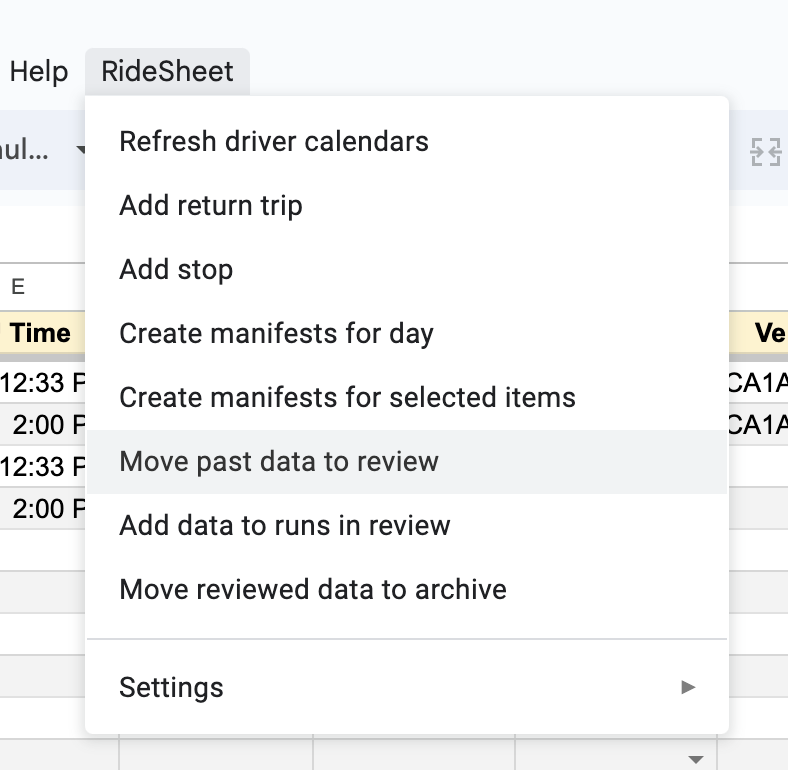

# Using RideSheet

This page covers the most common daily operations in RideSheet. 

## The Basics
RideSheet is a spreadsheet-based application consisting of multiple sheets or tabs. The basic view of RideSheet should look something like this:

This screenshot comes from the [RideSheet Public Sample](https://docs.google.com/spreadsheets/d/1U_rmR08qW63hEK_5IWblzVXK4ZqQElaD1ymAQNGpNiU/edit#gid=0). If you are interested in trying out RideSheet, you can simply make a copy of this sheet and test out anything you would like, or use it to follow along with this guide.

The first row of the spreadsheet, in yellow, is the header. Most of these fields are covered in detail in [Data Fields](data-fields.md). Some fields have blue headers or backgrounds. These fields are automatically populated by the application, and should not be edited by hand.

Along the bottom, you can see the various tabs, such as Customers, Trips, and Runs. You will probably need to scroll to see all of the different sheets.

In the main menu, you can see a dropdown menu item for **RideSheet**. This where you will run many of the workflows mentioned in this guide. 

### Common Workflows

**Handling Trip Requests**

1. Customer calls in to request a ride.
2. If they are a [new customer](#entering-new-customers), enter their information into the Customers sheet.
3. [Enter trip information](#entering-new-trip-requests) in the Trips sheet. 

**Daily Operations**

1. At the beginning of each day, [move all past trips and runs to review](#entering-trip-results).
1. Fill in all additional details in [trip review](#entering-trip-results) and [run review](#entering-run-results).
1. Daily (or at least weekly) [move completed run and trip data](#validating-and-archiving-data) to archive.
1. At the end of the day, generate the next day's [driver manifests](#creating-manifests).

### Tips for Working with Spreadsheets
When working with RideSheet, it's helpful to be familiar with basic spreadsheet operations. For more information on using Google Sheets, refer to [Google's official documentation](https://support.google.com/a/users/answer/9282959?hl=en).

!!! warning "A Word of Warning: Don’t Edit the Headers!"
    Editing the headers in RideSheet can disrupt the functionality of the application. Please refrain from modifying headers to ensure the proper operation of RideSheet.

## Entering New Customers
To enter new customers into RideSheet, follow these steps:

1. Navigate to the Customers sheet/tab.
2. Enter the customer's first and last name.
3. RideSheet will automatically assign a customer ID and generate the "Customer Name and ID" field, which is used to select the customer for trip requests.
4. Fill in remaining fields as needed.

!!! tip "Default Information"
    Although only the First and Last name are required, any field that begins with "Default" will be used later to autofill the relevant fields when creating a new trip for this customer. 

## Entering New Trip Requests
Within RideSheet, a **Trip** is a one-way segment between two locations. A round-trip journey requires two entries, and a multi-leg journey will requires a separate trip for each leg.

1. Navigate to the Trips sheet/tab.
2. Enter the required trip details, including the customer name, pickup address and time, drop-off address and time, appointment time (if applicable), count of guests or attendants, and any additional notes. [Learn more about Trip fields](data-fields.md#trips).
3. Associate the trip with specific resources such as the assigned driver and vehicle. This will be used for creating manifests and assigning trips to runs. If the combination of driver and vehicle is not valid at that time, the **Run OK?** field will turn red. 

To add a return trip:

1. In the **Action** column, select "Add return trip"
2. In the next column over, click the checkbox under **Go**
3. RideSheet will create a new trip with many details from the original.
4. Fill in pick-up time for the return trip, and double check that additional information is correct

{ width="500" }

### Autofill for Addresses and Times

When you fill in a PU and DO location, RideSheet will use Google Maps to automatically estimate the mileage and duration of the trip. If you fill in a `PU Time`, `DO Time`, **or** `Appt Time`, RideSheet will automatically fill in the other time fields based on the estimate. For example, if the estimated duration of the trip is 20 minutes and you set an appointment time at 2:00pm, RideSheet will automatically fill in the DO time at 1:50pm and the PU time at 1:30pm. The amount of padding is customizable in the configuration.

RideSheet also offers many utilities for managing addresses, and can autocomplete based on place names. [Learn more about addresses](data-fields.md#address-fields).

## Creating Runs

A run in RideSheet is simply defined as a specific combination of driver and vehicle during a specified time. RideSheet will automatically create a new run for a trip once a driver and vehicle are set for it in the `Trips` sheet.

You can also set up runs ahead of time in the `Runs` sheet, setting a scheduled start and end time for each vehicle/driver combination for that day. Any trips that are added for that day will automatically be assigned to the correct run. Ensuring that scheduled start and end times are filled out in `Runs` will allow `Trips` to accurately fill in the `Run OK?` field. 

## Creating Manifests

Before creating manifests, ensure that a driver and vehicle has been assigned to each of the day's trips. 

Select `Create manifests for day` from the RideSheet menu. A pop-up will appear, and you can choose to select a specific day or create manifests for the following day by default.

Once the job has finished running, you will be able to find the driver manifests in the `Manifests` folder within your Google Workspace directory. Manifests are created based on a [customizable manifest template](./customization.md).

## Entering Trip Results

Daily, you will want to move trips over to `Trip Review` in order to fill in trip details such as whether the trip was completed or canceled.

In the RideSheet menu, select `Move past data to review`. This will move any trips and runs with a Trip Date in the past over to the respective `Trip Review` and `Run Review` sheets.

{ width="300" }

Fill in the `Trip Result` for all trips from a day before attempting to [move them to archive](#validating-and-archiving-data) or run the [add data to runs in review](#adding-data-to-runs-in-review) process.

## Entering Run Results

As shown above in "Entering Trip Results", use the RideSheet menu to `Move past data to review`. 

Fill in the `Actual Start Time`, `Actual End Time`, `Break Time in Minutes`, `Odometer Start` and `Odometer End` for each run. It's imporant to fill in these fields for reports and in order to calculate `Revenue Miles` accurately.

Once all data is filled in for an entire day's runs, you can have RideSheet automatically calculate Revenue Miles, Deadhead Miles, and other useful information.

### Adding Data to Runs in Review

Once a day's information is complete in both `Trip Review` and `Run Review`, navigate to the RideSheet menu and select `Add data to runs in review`.

This will fill in all of the blue fields in `Run Review`, including Revenue Miles and Revenue Hours.

## Validating and Archiving Data

To move reviewed trips and runs to the archive, select `Move reviewed data to archive` in the RideSheet menu. This will move all complete data from `Trip Review` and `Run Review`. 

A **complete trip** has the `Trip Result` field filled out, plus any other custom requirements defined in `Document Properties`.

A **complete run** has a `Run Date`, `Driver ID`, `Vehicle ID`, and any custom requirements defined in `Document Properties`.

In addition, RideSheet can be [customized](./customization.md) to require other fields in `Trip Review` and `Run Review` to be completed before an entry can be moved to archive. 

Only trips and runs in archive are used for generating [reports](./reports.md). Any incomplete trips or runs left in review will not be included in report data.

## Creating Backups

To make a backup of RideSheet, simply navigate to `File` > `Make a copy`.

**Backup Tips**

- Create a copy every month or at least every quarter. 
- Store backup copies in a different folder in Google Workspace from your main copy
- Name backup copies after their date
- Annually, create a fresh copy of RideSheet, and delete information in Trip Archive and Run Archive. Name the previous copy for the year.

