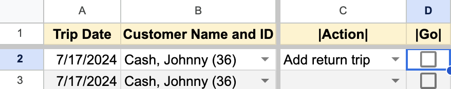

# Using RideSheet

This page covers the most common daily operations in RideSheet. 

## The Basics
RideSheet is a spreadsheet-based application consisting of multiple sheets or tabs. The basic view of RideSheet should look something like this:

This screenshot comes from the [RideSheet Public Sample](https://docs.google.com/spreadsheets/d/1U_rmR08qW63hEK_5IWblzVXK4ZqQElaD1ymAQNGpNiU/edit#gid=0). If you are interested in trying out RideSheet, you can simply make a copy of this sheet and test out anything you would like, or use it to follow along with this guide.

The first row of the spreadsheet, in yellow, is the header. Most of these fields are covered in detail in [Data Fields](data-fields.md)

Along the bottom, you can see the various tabs, such as Customers, Trips, and Runs. You will probably need to scroll to see all of the different sheets.

In the main menu, you can see a dropdown menu item for **RideSheet**. This where you will run many of the workflows mentioned in this guide. 

### Common Workflows

**Handling Trip Requests**

1. Customer calls in to request a ride
2. If they are a [new customer](#entering-new-customers), information is entered in the Customers sheet
3. Staff [enters trip information](#entering-new-trip-requests) in the Trips sheet

**Daily Operations**

1. Every morning, [driver manifests](#creating-manifests) are generated
2. At the beginning or end of each day, all past trips and runs are [moved to review](#entering-trip-results)

### Tips for Working with Spreadsheets
When working with RideSheet, it's helpful to be familiar with basic spreadsheet operations. For more information on using Google Sheets, refer to [Google's official documentation](https://support.google.com/a/users/answer/9282959?hl=en).

!!! warning "A Word of Warning: Don’t Edit the Headers!"
    Editing the headers in RideSheet can disrupt the functionality of the application. Please refrain from modifying headers to ensure the proper operation of RideSheet.

## Entering New Customers
To enter new customers into RideSheet, follow these steps:

1. Navigate to the Customers sheet/tab.
2. Enter the customer's first and last name.
3. RideSheet will automatically assign a customer ID and generate the "Customer Name and ID" field, which is used to select the customer for trip requests.
4. Fill in remaining fields as needed.

!!! tip "Default Information"
    Although only the First and Last name are required, any field that begins with "Default" will be used later to autofill the relevant fields when creating a new trip for this customer. 

## Entering New Trip Requests
Within RideSheet, a **Trip** is a one-way segment between two locations. A round-trip journey requires two entries, and a multi-leg journey will requires a separate trip for each leg.

1. Navigate to the Trips sheet/tab.
2. Enter the required trip details, including the customer name, pickup address and time, drop-off address and time, appointment time (if applicable), count of guests or attendants, and any additional notes. [Learn more about Trip fields](data-fields.md#trips).
3. Optionally, associate the trip with specific resources such as the assigned driver and vehicle. This will be used for creating manifests and assigning trips to runs.

To add a return trip:

1. In the **Action** column, select "Add return trip"
2. In the next column over, click the checkbox under **Go**
3. RideSheet will create a new trip with many details from the original.
4. Fill in pick-up time for the return trip, and double check that additional information is correct

### Autofill for Addresses and Times

When you fill in a PU and DO location, RideSheet will use Google Maps to automatically estimate the mileage and duration of the trip. If you fill in a PU time, DO time, **or** appointment time, RideSheet will automatically fill in the other time fields based on the estimate. For example, if the estimated duration of the trip is 20 minutes and you set an appointment time at 2:00pm, RideSheet will automatically fill in the DO time at 1:50pm and the PU time at 1:30pm. The amount of padding is customizable in the configuration.

RideSheet also offers many utilities for managing addresses, and can autocomplete based on place names. [Learn more about addresses](data-fields.md#address-fields).

## Creating Runs

## Assigning Trip Requests to Runs

## Creating Manifests

## Entering Trip Results

## Validating and Archiving Data

## Creating Backups

